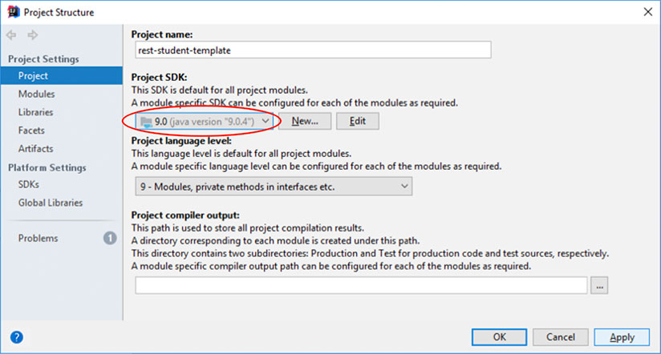

# Verteilte Systeme: RESTful Webservices

## Aufgabenstellung

Dies ist ein Projekt-Template für Ihre erste RESTful-Webservice-Applikation rund um die CRUD-Methoden der Ressource (Entity) *Student*.

Die Aufgabenstellung finden Sie [hier](AUFGABENSTELLUNG.md).

## Installation des Templates

> **Achtung**  Dieses Template ist gültig für *JDK9* oder *JDK10* zusammen mit *git* und *IntelliJ IDEA*. Für das *JDK11* gibt es ein eigenes Template-Projekt! Ältere Java-Versionen werden für diese VS-Übungen nicht mehr unterstützt, ggf. finden Sie noch Vorlagen für das JDK8 zum Download in GRIPS.

1. Navigieren Sie zu einem Ordner Ihrer Wahl, in dem Sie das Projekt erstellen möchten
2. Öffnen Sie die Konsole (Windows Eingabeaufforderung *cmd*, Windows *PowerShell*, Mac *Terminal*)
3. Klonen Sie das Projekt (Template) mittels `git clone http://im-lamport:1080/vs/rest-student-template.git`

4. Starten Sie IntelliJ IDEA
5. Wählen Sie *Open* (nicht *Import*!) 

6. Wählen Sie zum Öffnen das neu geklonte *Verzeichnis* `rest-student-template` aus
7. Bestätigen Sie im erscheinenden Hinweis-Dialog (meist rechts unten) unbedingt, dass das Projekt als *Maven-Projekt* geöffnet wird

8. Nach dem Öffnen werden einige *Dependencies* automatisch heruntergeladen, dies kann einen Moment dauern (in der Statuszeile unten wird ein entsprechender Hinweis und Fortschrittsbalken angezeigt)
9. Dem Projekt ist wahrscheinlich noch kein SDK (JDK) zugeordnet, dies wird mit einer entsprechenden Fehlermeldung angezeigt

10. Wählen Sie im darauf erscheinenden Dialog Ihr SDK aus (JDK9 oder JDK10 ist zwingend erforderlich; sollten Sie kein aktuelles JDK auf Ihrem Rechner installiert haben installieren Sie dies bitte (derzeit JDK11) und nutzen hierzu auch das entsprechende Template. Dieses Template ist gültig für die nicht mehr verfügbaren JDK-Versionen 9 und 10!) 
(Dieser Dialog kann auch nachträglich über einen rechten Mausklick auf Ihr Projekt --> "Open Module Settings" geöffnet werden.)

11. Zuletzt müssen Sie noch eine *Run Configuration* hinzufügen, die den Start über den Play-Button rechts oben ermöglicht.
Wählen Sie dazu über das Menü *Run* --> *Edit Configurations..." oder klicken Sie rechts oben auf die Schaltfläche *Edit Configurations...*. Es erscheint folgender Dialog:

Wählen Sie links oben über das Plus-Zeichen *+* --> *Application* aus, um eine Application-Configuration hinzuzufügen.
Tragen Sie den *Name*, die *Main Class* sowie die *VM Options* nach obigem Beispiel ein und wählen Sie abschließend *Apply* und *OK*.
12. Der Webserver startet, über den Stop-Button oder über den angezeigten Dialog können Sie den Server wieder stoppen:

#### Trouble Shooting

Sollte ein Starten des Projekts (Klasse `app.Server`) auf Grund von Exceptions nicht möglich sein, überprüfen Sie bitte noch folgende Einstellungen:

- Überprüfen Sie ggf. die Compilereinstellungen über *File* --> *Settings* --> *Build, Execution, Deployment* --> *Java Compiler*

## JAX-RS 2.1 RESTful Webservices in Java mit JAX-RS und Jersey

Die [JAX-RS 2.1 Spezification](https://github.com/jax-rs) spezifiziert die Unterstützung von RESTful-Webservice-APIs. 

[Jersey](https://jersey.github.io) ist die zugehörige JAX-RS-Referenzimplementierung für eine konkrete Umsetzung. Nutzen Sie die Dokumentationsseiten und weitere Suchergebnisse im Netz zu diesen Themen, sofern Sie sich mit dieser Thematik tiefer befassen möchten.

## JAX-RS Clients

JAX-RS bietet natürlich auch API-Klassen an, um eine Client-Anwendung in Java zu implemenieren. 

Im Rahmen der Übungen werden zur Vereinfachung aber nur Browser-Plugins als generische Client verwendet. Installieren Sie hierzu ein passendes Plugin für Ihren Browser, z. B.  [RESTer for Crome](https://chrome.google.com/webstore/detail/rester/eejfoncpjfgmeleakejdcanedmefagga?hl=en) oder für [Firefox](https://addons.mozilla.org/en-US/firefox/addon/rester/).
 

